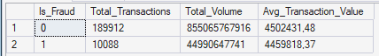
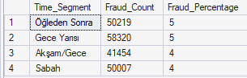
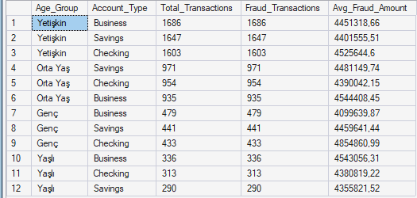
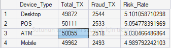

## 📌 Proje Hakkında

  Bu proje, kapsamlı bir bankacılık veri seti üzerinde SQL kullanarak dolandırıcılık (fraud) tespiti ve analizi gerçekleştirmeyi amaçlamaktadır.
Proje kapsamında ham veriler temizlenmiş, teknik ön işleme adımlarından geçirilmiş ve iş mantığına uygun yeni özellikler (feature engineering) türetilerek riskli müşteri segmentleri ile şüpheli işlem desenleri ortaya çıkarılmıştır.
Temel hedef, veri odaklı yaklaşımlarla finansal güvenliği artıracak çıkarımlar yapmaktır.

## 🛠️ Uygulanan Teknik Süreçler
1. Veri Temizleme & Hazırlık (Data Cleaning)

Analizlerin doğruluğunu sağlamak adına şu teknik adımlar uygulanmıştır:
Eksik Veri Kontrolü: Tüm tablo taranarak NULL değer içermediği teyit edilmiştir.
Standardizasyon: TRIM fonksiyonu ile metin alanlarındaki gereksiz boşluklar temizlenmiş; Gender, State gibi kategorik veriler büyük harf formatına getirilmiştir.
Mantıksal Doğrulama: Age (Yaş) ve Transaction_Amount (İşlem Tutarı) gibi alanlarda negatif veya imkansız değerlerin (örneğin 100+ yaş) kontrolü yapılarak veri bütünlüğü sağlanmıştır.
Tekilleştirme (Duplicate): Duplicate Transaction_ID kayıtları kontrol edilerek temizlenmiştir.

3. Kullanılan Uygulamalar ve Yöntemler

Veritabanı Yönetimi: Veri depolama ve sorgulama işlemleri için Microsoft SQL Server (MSSQL) kullanılmıştır.
Zaman Serisi İşleme: Transaction_Date ve Transaction_Time kolonları birleştirilerek DATETIME formatında tekil bir zaman damgası oluşturulmuştur.

Feature Engineering:
Time_Segment: İşlem saatlerine göre 'Gece Yarısı', 'Sabah' gibi zaman dilimleri oluşturulmuştur.
Age_Group: Müşteriler yaşlarına göre 'Genç', 'Yetişkin', 'Orta Yaş' ve 'Yaşlı' olarak segmente edilmiştir.
Transaction_Size: Harcama tutarları 'Küçük'ten 'Çok Büyük'e kadar kategorize edilmiştir.

## 📈 Önemli Analiz Bulguları
1.Genel Fraud Dağılımı.

-- 

İşlem Hacmi: Sistemde toplam 189.912 normal işlem gerçekleşirken, 10.088 adet fraud (dolandırıcılık) vakası tespit edilmiştir.
Maddi Etki: Dolandırıcılık işlemlerinin ortalama tutarı (445.918,37) ile normal işlemlerin ortalaması (450.241,48) birbirine oldukça yakındır. 
Bu durum, dolandırıcıların dikkat çekmemek için standart işlem tutarlarını taklit ettiğini göstermektedir.

2. Zaman Dilimi Analizi

-- 

En Riskli Saatler: Dolandırıcılık oranları gün geneline yayılmış olsa da, "Öğleden Sonra" ve "Gece Yarısı" segmentleri %5'lik oranlarla en yüksek riskli dilimler olarak öne çıkmaktadır.
Süreklilik: Sabah ve Akşam saatlerinde riskin %4'e düşmesi, dolandırıcılık faaliyetlerinin günün her saatinde aktif bir tehdit oluşturduğunu kanıtlamaktadır.

3. Demografik ve Hesap Segmentasyonu

-- 

Yetişkin Grubu: Dolandırıcılık işlemlerinin en çok hedef aldığı grup "Yetişkin" kategorisidir. Özellikle bu gruptaki Business, Savings ve Checking hesap türlerinin her biri 1.600'den fazla fraud vakasıyla en yüksek frekansa sahiptir.
Hesap Türü Etkisi: "Yetişkin" grubundaki Business hesaplar, 4.451.318,66'lık toplam ortalama ile hacimsel olarak en büyük riski taşımaktadır.

4. Cihaz Bazlı Risk Analizi

-- 

Cihaz Riski: Tüm cihaz türlerinde (Desktop, POS, ATM, Mobile) risk oranı %5 civarında sabitlenmiştir.
Öne Çıkan Cihaz: Desktop (Masaüstü) kullanımı, %5.10'luk oranla diğer cihazlara göre cüzi bir farkla en riskli kanal olarak tespit edilmiştir. Onu %5.05 ile POS cihazları takip etmektedir.

## Analiz Özeti:
"Yapılan analizler sonucunda, banka dolandırıcılığı faaliyetlerinin belirli bir kanal veya saatle sınırlı kalmadığı, 
ancak özellikle Yetişkin segmentindeki Business hesapların ve Masaüstü cihazlar üzerinden yapılan işlemlerin öncelikli denetim gerektirdiği gözlemlenmiştir."

- ## 📬 İletişim
- Bu proje ile ilgili sorularınız veya önerileriniz için benimle [LinkedIn profilim](https://www.linkedin.com/in/deniz-bal-64838b225) üzerinden iletişime geçebilirsiniz.
